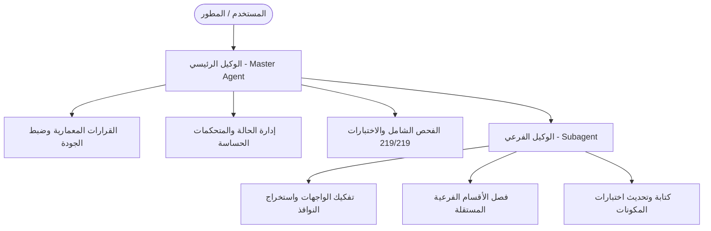
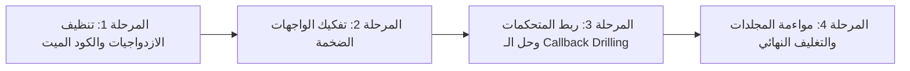

# 12. خطة إعادة الهيكلة الشاملة ومواءمة المعمارية (Refactoring & Architecture Alignment Plan)

## نظرة عامة (Overview)
تهدف هذه الخطة إلى معالجة الديون التقنية المتراكمة والازدواجيات والترهل في الملفات الضخمة الناتجة عن سرعة بناء الميزات السابقة في مشروع **TaskyW**، مع الالتزام التام بعدم كسر أو تغيير أي ميزة تشغيلية، والحفاظ المستمر على نسبة نجاح 100% لجميع الاختبارات (219/219 اختباراً) وفحص `flutter analyze` خالٍ تماماً من الأخطاء والتحذيرات.

---

## هيكل القيادة وتوزيع الأدوار (Leadership & Roles Distribution)

### 1. الوكيل الرئيسي (Master Agent - Lead Architect)
* **المسؤولية العليا**:
  * الإشراف الكامل على البنية المعمارية وتنسيق العمل وتسلسل المهام.
  * إدارة التغييرات الحساسة في طبقة البيانات وإدارة الحالة المركزية (`Controllers` و `Repositories`).
  * اتخاذ القرارات المعمارية الفاصلة وحل أي تعارضات (Conflicts).
  * إجراء الفحص النهائي للجودة (`flutter analyze` و `flutter test`).
  * التحديث الرسمي لوثائق المشروع (`MASTER_PLAN.md` و `COMPLETED_WORK.md`).
  * تفويض المهام المحددة بدقة إلى الوكيل الفرعي ومراجعة مخرجاته قبل اعتمادها.

### 2. الوكيل الفرعي (Subagent - Component Implementation Specialist)
* **المسؤولية التنفيذية**:
  * تنفيذ حزم مهام معزولة ومحددة النطاق يُكلف بها من قِبل الوكيل الرئيسي.
  * تفكيك الواجهات الكبيرة واستخراج المكونات الفرعية الصرفة (Pure UI Components & Dialogs).
  * كتابة وتحديث اختبارات الواجهات للمكونات المستخرجة حديثاً.
  * **الضوابط الصارمة**:
    * لا يعدل على جداول أو ترقيات قاعدة البيانات أو سكيما المزامنة السحابية.
    * لا يمس الملفات المشتركة إلا بتنسيق مسبق منعاً لتضارب الأكواد (Merge Conflicts).
    * يلتزم بإنهاء كل مهمة فرعية بفحص نظيف (`flutter analyze`) قبل تسليم المهمة للماستر.

---

## محاور وخريطة مراحل إعادة الهيكلة (Detailed Refactoring Phases)

---

### 🔹 المرحلة 1: تنظيف الازدواجيات والكود الميت (Deduplication & Dead Code Removal) — ✅ مكتملة
* **الهدف**: القضاء على الازدواجية في نماذج المشاركة والخدمات القديمة غير المستخدمة. ✔ تم
* **المهام التفصيلية** (كافة بنودها منجزة):
  1. **توحيد نموذج المشاركة `EntityShareModel`** — ✔ تم:
     * الاعتماد الحصري على نموذج `EntityShareModel` الموجود في `lib/features/collaboration/data/models/entity_share_model.dart` ودعمه لكافة الحالات (المشاركة العامة برابط + مشاركة الأعضاء بحساب).
     * دعم النموذج الموحد بالحقول والدوال: `role` (alias لـ `permissionLevel`)، `shareToken`، `isPublic`، `isPublicLink`، مع قراءة مرنة في `fromMap` لمفاتيح `permission_level` / `permission` / `role` و`share_token` / `is_public` و`collaborator_email` / `email`.
     * حذف الملف القديم المكرر `lib/core/models/entity_share_model.dart` — ✔ نُفّذ الحذف نهائياً.
  2. **تنظيف منظومة المشاركة القديمة** — ✔ تم:
     * توجيه `ShareReadService` للاعتماد على النموذج الموحد (لم يعد يعتمد على أي نموذج قديم إطلاقاً).
     * إزالة الكود الميت `SharingController` غير المستخدم في الواجهات (حذف الملف)، وتحديث الاختبارات المرتبطة به حيث يعتمد `share_read_service_test.dart` الآن على النموذج الموحد حصرياً.
* **توزيع الأدوار**:
  * **الوكيل الفرعي**: فحص وتحديث واردات (Imports) كلاس `EntityShareModel` وتعديل اختبار `share_read_service_test.dart`. — ✔ منفذ
  * **الوكيل الرئيسي**: مراجعة التوحيد المعماري، حذف الملفات الزائدة، وتشغيل فحص السلامة الشامل. — ✔ منفذ
* **نتيجة التحقق (DoD)**: `flutter analyze` → `No issues found!` ✔ | `flutter test` → جميع الاختبارات ناجحة (238/238) ✔

---

### 🔹 المرحلة 2: تفكيك الواجهات العملاقة (Decomposing God Widgets)
* **الهدف**: تقسيم الملفات التي تجاوزت 1,000 سطر إلى مكوّنات نظيفة يسهل صيانتها واختبارها.

#### 2.1 تفكيك `MainLayoutScreen` (1,526 سطراً):
1. **استخراج نوافذ الحوار إلى مجلد مستقل (`lib/features/home/presentation/widgets/dialogs/`)** — ✅ مكتمل (تقليص ~406 أسطر):
   * `AddTaskDialog`: نافذة إضافة المهمة السريعة بتفاصيلها. ✔
   * `AddProjectDialog`: نافذة إضافة المشروع مع الإيموجي والألوان. ✔
   * `AddAreaDialog`: نافذة إضافة المجال. ✔
   * `ExportTasksDialog`: نافذة تصدير ومعاينة CSV/Excel. ✔
   * (مستخرج أيضاً في نفس المجلد: `CreateTagDialog`.) ✔
2. **استخراج شريط الرأس (`MainTopHeader`)** — ✅ مكتمل:
   * نقل ترويسة الشاشات العريضة والموبايل وحقل البحث التكيفي إلى ويدجت مستقل `MainTopHeader`. ✔
3. **استخراج موزع مساحة العمل (`MainWorkspaceContent`)** — ✅ مكتمل:
   * فصل تبديل المحتوى (قائمة، كانبان، جدول، تفاصيل مشروع، تفاصيل مجال، ملاحظات، مالية) إلى ويدجت منظم `MainWorkspaceContent`. ✔

#### 2.2 تفكيك `TaskDetailDrawer` (1,005 أسطر): — ✅ مكتمل
* تقسيم الدرج إلى مكونات فرعية في (`lib/features/tasks/presentation/widgets/task_drawer/`):
  * `task_subtasks_section.dart` (`TaskSubtasksSection`): إدارة وتشيك ليست المهام الفرعية. ✔
  * `task_properties_section.dart` (`TaskPropertiesSection`): الخصائص والمواعيد والتكرار والتذكيرات. ✔
  * `task_tags_section.dart` (`TaskTagsSection`): اختيار وإنشاء الوسوم التفاعلية. ✔

#### 2.3 تحسين `HierarchicalTreeSidebar` (953 سطراً):
* تفكيك عناصر الشجرة الجانبية إلى مكوّنات فرعية:
  * `SidebarSmartFiltersSection`: اليوم، القادمة، المعلقة، العاجلة.
  * `SidebarAreasTreeSection`: المجالات والمشاريع التابعة لها بنسب الإنجاز.
  * `SidebarTagsSection`: قائمة الوسوم مع عداداتها.
  * `SidebarSharedSection`: المشاريع والمجالات المشتركة مع المستخدم.

* **توزيع الأدوار**:
  * **الوكيل الفرعي**:
    * استخراج حوارات `AddTaskDialog`, `AddProjectDialog`, `AddAreaDialog`, `ExportTasksDialog`. — ✔ منفذ
    * استخراج أقسام درج تفاصيل المهمة `TaskDetailDrawer` وتحويلها لملفات مستقلة. — ✔ منفذ
  * **الوكيل الرئيسي**:
    * إعادة تجميع `MainLayoutScreen` و `TaskDetailDrawer` باستخدام المكونات المستخرجة. — ✔ منفذ
    * التحقق من ثبات شجرة الـ Widgets واستقرار كافة اختبارات الـ UI (`widget_test.dart` و `task_list_view_test.dart` و `task_attachments_section_test.dart`). — ✔ منفذ

---

### 🔹 المرحلة 3: ربط المتحكمات وحل Callback Drilling (State Management Alignment) — ✅ مكتملة
* **الهدف**: التخلص من تمرير أكثر من 20 كولباك في الشاشات، وتفعيل المتحكمات الجاهزة التي بنيت ولم تُستخدم في الواجهة الرئيسية. ✔ تم ربطها في `TaskyHomeScreen`.

---

### 🔹 المرحلة 4: إعادة تنظيم هيكلية المجلدات والتغليف النهائي (Folder Structure Alignment) — ✅ مكتملة
* **الهدف**: نقل الملفات الموضوعة في مسارات غير متناسقة إلى حزم ميزاتها المناسبة (Clean Architecture Modular Packaging). ✔ تم نقل ميزة الوسوم بالكامل وتحديث كافة الواردات.

---

## مصفوفة الصلاحيات وحدود العمل (Permissions & Boundaries Matrix)

| الإجراء | الوكيل الرئيسي (Master Agent) | الوكيل الفرعي (Subagent) |
| :--- | :---: | :---: |
| تعديل ملفات التخطيط والوثائق (`MASTER_PLAN.md`, `COMPLETED_WORK.md`) | ✅ مسموح حصرياً | ❌ ممنوع |
| تعديل نماذج قواعد البيانات وخدمات المزامنة السحابية | ✅ مسموح | ❌ ممنوع |
| إجراء تعديلات على المتحكمات المركزية (`State Controllers`) | ✅ مسموح | ⚠️ بتفويض صريح فقط |
| استخراج مكونات الواجهات وتفكيك ملفات العرض (`UI Widgets & Dialogs`) | ✅ مسموح | ✅ مسموح وموصى به |
| كتابة وتعديل اختبارات الوحدة والواجهات الخاصة بالمكونات | ✅ مسموح | ✅ مسموح وموصى به |
| التحقق النهائي الشامل وتأكيد اعتماد المرحلة للمستخدم | ✅ مسموح حصرياً | ❌ ممنوع |

---

## معايير الجودة والإنجاز لكل خطوة (Definition of Done - DoD)
قبل إعلان اكتمال أي خطوة أو مرحلة من المراحل الأربع:
1. أن ينتهي أمر `flutter analyze` بنتيجة **`No issues found!`** (0 أخطاء و 0 تحذيرات).
2. أن تنجح جميع اختبارات التطبيق **238/238 اختباراً بنسبة 100%** دون أي إخفاق.
3. عدم انكسار أي ميزة أو تجربة استخدام بصرية على أي منصة (Desktop, Mobile, Web).
4. توثيق المنجزات في سجل الأعمال وتحديث حالة الخطة.
