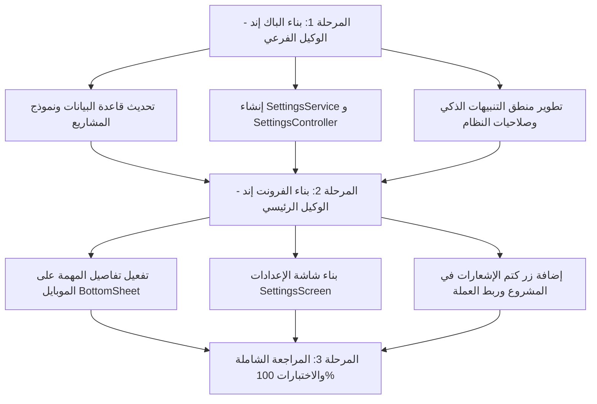

# خطة تجربة الموبايل، التنبيهات الذكية المخصصة، ونظام الإعدادات الشامل
### Document ID: `13_MOBILE_UX_NOTIFICATIONS_AND_SETTINGS_PLAN.md`
### ارتباط الماستر بلان: مرتبط بـ `MASTER_PLAN.md` (القسم الثاني - بند 9)

---

## 1. نظرة عامة والأهداف (Overview & Objectives)
تهدف هذه الخطة إلى نقل تجربة استخدام **TaskyW** على الهواتف والأجهزة الذكية إلى مستوى احترافي عالي الجودة، وحل أوجه القصور الحالية في التنبيهات والموبايل من خلال:
1. **تفعيل فتح تفاصيل المهمة على الموبايل (`Mobile Task Details`)**:
   - إتاحة فتح تفاصيل أي مهمة بنقرة واحدة عبر نافذة سفلية قابلة للسحب والتمرير (`ModalBottomSheet`) بنسبة 90% من الشاشة.
2. **نظام التنبيهات الذكي متعدد المستويات (Multi-Tier Notifications System)**:
   - **المستوى العام (Global Level)**: مفتاح تشغيل/إيقاف عام لكافة الإشعارات من شاشة الإعدادات.
   - **المستوى المخصص للمشروع (Project-Level Notification Control)**: إمكانية تفعيل أو كتم (Mute/Enable) تنبيهات كل مشروع على حدة بشكل مستقل، بحيث لا تصدر تنبيهات لمهام المشاريع المكتومة حتى لو وُضع لها وقت تذكير.
   - **إدارة صلاحيات النظام (System Permissions Management)**: تفعيل طلب الإذن الصريح في أندرويد و iOS (`requestPermissions`) عند بدء التطبيق أو من الإعدادات.
   - **الجدولة الذكية**: فحص حالة الإعدادات العامة وحالة المشروع تلقائياً قبل تسجيل أي تنبيه محلي.
3. **شاشة ونظام الإعدادات المركزي (`Settings Module`)**:
   - شاشة متكاملة وحديثة تتيح التحكم في:
     - **الإشعارات**: تفعيل عام، كتم نغمة، وقت التذكير الافتراضي، فحص الصلاحية.
     - **المالية والعملات**: اختيار العملة الافتراضية للنظام (`SAR`, `EGP`, `USD`, `AED`, `EUR`, إلخ) واعتمادها تلقائياً في السجلات المالية.
     - **المظهر وتجربة العرض**: الثيم (فاتح/داكن/OLED)، طريقة العرض الافتراضية (قائمة/كانبان/جدول).
     - **البيانات والمزامنة**: حالة المزامنة السحابية، مسح الكاش، والنسخ الاحتياطي.
     - **عن التطبيق**: الإصدار وتفاصيل الترخيص.

---

## 2. مصفوفة تقسيم الأدوار بين الوكلاء (Agent Specialization Matrix)

وفقاً لقواعد المشروع في [AGENTS.md](file:///d:/programming/Tasky3.0/AGENTS.md) (البند 3):

| المجال | الوكيل المسؤول | نطاق العمل والملفات المستهدفة |
| :--- | :--- | :--- |
| **الباك إند والمنطق (Backend & Logic)** | **الوكيل الفرعي (Sub Agent)** | • ترقيات قاعدة البيانات المحلية (SQLite Migration) وسكيما السحابة (Supabase SQL).<br>• تحديث النماذج والمستودعات (`ProjectModel`, `ProjectRepository`).<br>• بناء خدمة ونموذج الإعدادات (`SettingsService`, `AppSettingsModel`).<br>• إنشاء متحكم الإعدادات (`SettingsController`).<br>• تطوير وترقية خدمة التنبيهات (`NotificationService`) بمنطق الفحص الصارم.<br>• كتابة اختبارات الوحدة للخدمات والمستودعات. |
| **الواجهات وتجربة المستخدم (Frontend & UI)** | **الوكيل الرئيسي (Main Agent)** | • قيادة ومراقبة خطة العمل والتنسيق العام.<br>• تصميم نافذة تفاصيل المهمة للموبايل (`TaskDetailBottomSheet`) في `MainLayoutScreen`.<br>• تصميم وتنسيق شاشة الإعدادات الشاملة (`SettingsScreen`).<br>• إضافة زر وأيقونة كتم/تفعيل التنبيهات في شاشة وبطاقات المشروع (`ProjectDetailScreen` وحوارات المشاريع).<br>• ربط شارات المشروع التفاعلية في كروت المهام بجميع طرق العرض (List و Kanban) وخيار التجميع حسب المشروع.<br>• ربط العملة الافتراضية المختارة بحوار السجل المالي `RecordDialog`.<br>• ربط زر الإعدادات بالقائمة الجانبية والشريط السفلي.<br>• التحقق البصري واختبارات تكامل الواجهات. |

---

## 3. تفاصيل حزم العمل البرمجية (Work Breakdown Structure)

### 🔹 الحزمة الأولى: الباك إند والمنطق (Sub Agent Tasks)

#### 1. ترقية قاعدة البيانات وجدول المشاريع (`projects` Table Migration)
- إضافة حقل `notifications_enabled INTEGER NOT NULL DEFAULT 1` في SQLite:
  - مسار الكود: `lib/core/database/database_tables.dart` و `database_service.dart`.
  - توليد ترحيل محلي آمن يضمن عدم فقدان البيانات القائمة.
  - إعداد أمر ترحيل متوافق مع Supabase لمشروع Tasky (`yjcpevqahefzcpbvajcq`):
    ```sql
    ALTER TABLE public.projects ADD COLUMN IF NOT EXISTS notifications_enabled BOOLEAN NOT NULL DEFAULT true;
    ```
- تحديث نموذج البيانات `ProjectModel`:
  - إضافة `final bool notificationsEnabled;` مع القيمة الافتراضية `true`.
  - تحديث `toMap`, `fromMap`, `copyWith`.
  - تحديث `ProjectRepositoryImpl`.

#### 2. بنية تخزين وإدارة الإعدادات واللغات (`Settings & Localization Module`)
- إضافة `flutter_localizations: sdk: flutter` و `intl` في `pubspec.yaml`.
- إنشاء نموذج الإعدادات `lib/features/settings/data/models/app_settings_model.dart`:
  - `notificationsEnabled` (bool, default: true).
  - `defaultReminderOffsetMinutes` (int, default: 0).
  - `defaultCurrency` (String, default: 'SAR').
  - `defaultViewMode` (String, default: 'list').
  - `startOfWeek` (int, default: 6 - السبت).
  - `languageCode` (String, default: 'system') — يدعم:
    * `'system'`: استخدام لغة الجهاز تلقائياً (الخيار الافتراضي).
    * `'ar'`: اللغة العربية حصراً مع تفعيل اتجاه اليمين لليسار (RTL).
    * `'en'`: اللغة الإنجليزية حصراً مع تفعيل اتجاه اليسار لليمين (LTR).
- إنشاء خدمة التخزين `SettingsService` عبر `shared_preferences`:
  - حفظ واسترجاع الإعدادات وكود اللغة فورياً.
- إنشاء `SettingsController` كـ `ChangeNotifier`:
  - نمط Singleton لسهولة الوصول إليه في كامل طبقات التطبيق.
  - خاصية `Locale? get activeLocale`: تُرجع `null` عند اختيار 'system' ليحدد Flutter لغة النظام تلقائياً، أو `Locale('ar')` / `Locale('en')` عند التحديد اليدوي.
  - دالة `updateLanguage(String code)` لتغيير اللغة والاتجاه لحظياً دون الحاجة لإعادة تشغيل التطبيق.
  - دوال `updateNotificationsEnabled(bool)`, `updateDefaultCurrency(String)`, إلخ.

#### 3. ترقية خدمة التنبيهات (`NotificationService`)
- دعم فحص الصلاحيات الكامل:
  - تنفيذ `requestPermissions()` مع معالجة أذونات أندرويد 13+ (`POST_NOTIFICATIONS`) و iOS.
  - دالة `Future<bool> checkPermissionStatus()` لمعرفة هل التنبيهات مسموحة بالنظام أم محظورة.
- دمج الفحص الذكي للجدولة (`Smart Scheduling Logic`):
  ```dart
  Future<void> scheduleTaskReminder({
    required TaskModel task,
    ProjectModel? project,
  }) async {
    // 1. فحص هل الإعدادات العامة تسمح بالتنبيهات
    if (!SettingsController.instance.notificationsEnabled) return;
    // 2. فحص هل المشروع التابع له المهمة مكتوم التنبيهات
    if (project != null && !project.notificationsEnabled) return;
    // 3. جدولة التنبيه الفعلي
    ...
  }
  ```
- دالة إعادة مزامنة التنبيهات: عند تغيير تفعيل تنبيهات مشروع ما، يتم تحديث/إلغاء التنبيهات المعلقة لمهام ذلك المشروع.

---

### 🔹 الحزمة الثانية: الفرونت إند وتجربة المستخدم (Main Agent Tasks)

#### 1. تفاصيل المهمة على الموبايل (`Mobile Task Details BottomSheet`)
- تعديل `MainLayoutScreen`:
  - عند الضغط على كارت المهمة في وضع الموبايل (`!isDesktop`):
    - فتح `showModalBottomSheet` بحواف علوية مستديرة (`BorderRadius.vertical(top: Radius.circular(20))`).
    - ضبط `isScrollControlled: true` وارتفاع ديناميكي مناسب (85% - 95% من الشاشة).
    - تغليف `TaskDetailDrawer` أو مكوناته ليعمل بسلاسة تامة مع إيماءات السحب لأسفل والإغلاق.
  - الحفاظ التام على درج الديسكتوب المنزلق (`isDesktop`) دون أي كسر لتجربة الشاشات الكبيرة.

#### 2. شاشة الإعدادات الشاملة (`SettingsScreen`)
- إنشاء شاشة عصرية وأنيقة مقسمة لبطاقات:
  - **قسم الإشعارات والتذكيرات**:
    - مفتاح التبديل الرئيسي للتنبيهات (مع تنبيه بصري إن كانت صلاحيات الهاتف محظورة مع زر لفتح إعدادات الجهاز أو طلب الإذن).
    - وقت التذكير الافتراضي (قائمة منسدلة: عند الموعد، قبل بـ 15 دقيقة، قبل بساعة، قبل بيوم).
  - **قسم المالية والعملة**:
    - منتقي العملة الافتراضية (`SAR`، `EGP`، `USD`، `AED`، `EUR`، `KWD`، إلخ) مع إشارة واضحة للعملة الحالية.
  - **قسم المظهر وتجربة الاستخدام**:
    - اختيار الثيم الثلاثي (نهاري، ليلي، OLED).
    - طريقة العرض الافتراضية للمهام (قائمة، كانبان، جدول).
  - **قسم المزامنة والبيانات**:
    - كارت حالة الاتصال بالسحابة ومفتاح مسح الذاكرة المؤقتة (Clear Cache).
  - **قسم حول TaskyW**:
    - رقم الإصدار ومعلومات الدعم.

#### 3. تخصيص التنبيهات في المشروع (`Project Notifications UI`)
- إضافة مفتاح/أيقونة كتم التنبيهات في:
  - **شاشة تفاصيل المشروع (`ProjectDetailScreen`)**: في شريط الهيدر العلوي بجانب أزرار المشاركة والأرشفة (أيقونة جرس مفعّل/مكتوم `Icons.notifications_active_outlined` / `Icons.notifications_off_outlined`).
  - **حوار إضافة وتعديل المشروع (`AddProjectDialog` / `EditProjectDialog`)**: خيار تبديل "تفعيل إشعارات هذا المشروع".

#### 4. إدارة رقم الإصدار ودوال تحديث الحساب (Versioning & Profile Logic)
- إنشاء ملف الثوابت المركزي: `lib/core/constants/app_version.dart` وتحديث `pubspec.yaml` ليبدأ من `3.0.0+1`.
- إضافة دالة `updateDisplayName(String newName)` ودعم تعديل الملف الشخصي في `AuthController`.

---

### 🔹 الحزمة الثانية: الفرونت إند وتجربة المستخدم (Main Agent Tasks)

#### 1. تفاصيل المهمة على الموبايل (`Mobile Task Details BottomSheet`)
- تعديل `MainLayoutScreen`:
  - عند الضغط على كارت المهمة في وضع الموبايل (`!isDesktop`):
    - فتح `showModalBottomSheet` بحواف علوية مستديرة (`BorderRadius.vertical(top: Radius.circular(20))`).
    - ضبط `isScrollControlled: true` وارتفاع ديناميكي مناسب (85% - 95% من الشاشة).
    - تغليف `TaskDetailDrawer` أو مكوناته ليعمل بسلاسة تامة مع إيماءات السحب لأسفل والإغلاق.
  - الحفاظ التام على درج الديسكتوب المنزلق (`isDesktop`) دون أي كسر لتجربة الشاشات الكبيرة.

#### 2. شاشة الإعدادات الشاملة (`SettingsScreen`)
- إنشاء شاشة عصرية وأنيقة مقسمة لبطاقات:
  - **قسم الإشعارات والتذكيرات**:
    - مفتاح التبديل الرئيسي للتنبيهات (مع تنبيه بصري إن كانت صلاحيات الهاتف محظورة مع زر لفتح إعدادات الجهاز أو طلب الإذن).
    - وقت التذكير الافتراضي (قائمة منسدلة: عند الموعد، قبل بـ 15 دقيقة، قبل بساعة، قبل بيوم).
  - **قسم المالية والعملة**:
    - منتقي العملة الافتراضية (`SAR`، `EGP`، `USD`، `AED`، `EUR`، `KWD`، إلخ) مع إشارة واضحة للعملة الحالية.
  - **قسم اللغة والمنطقة (Language & Region)**:
    - منتقي لغة التطبيق بخيارات واضحة مع أيقونات وأعلام:
      * 🌐 **تلقائي (لغة الجهاز - System Default)**: يتبع لغة إعدادات الهاتف تلقائياً.
      * 🇸🇦 **العربية (Arabic)**: يفرض الواجهة العربية واتجاه RTL.
      * 🇺🇸 **English (الإنجليزية)**: يفرض الواجهة الإنجليزية واتجاه LTR.
    - التغيير الفوري والانعكاس اللحظي للاتجاه والنصوص عبر `MaterialApp`.
  - **قسم المظهر وتجربة الاستخدام**:
    - اختيار الثيم الثلاثي (نهاري، ليلي، OLED).
    - طريقة العرض الافتراضية للمهام (قائمة، كانبان، جدول).
  - **قسم المزامنة والبيانات**:
    - كارت حالة الاتصال بالسحابة ومفتاح مسح الذاكرة المؤقتة (Clear Cache).
  - **قسم حول TaskyW**:
    - قراءة وعرض رقم الإصدار من `AppVersion.version` وروابط الدعم.

#### 3. تخصيص التنبيهات في المشروع (`Project Notifications UI`)
- إضافة مفتاح/أيقونة كتم التنبيهات في:
  - **شاشة تفاصيل المشروع (`ProjectDetailScreen`)**: في شريط الهيدر العلوي بجانب أزرار المشاركة والأرشفة (أيقونة جرس مفعّل/مكتوم `Icons.notifications_active_outlined` / `Icons.notifications_off_outlined`).
  - **حوار إضافة وتعديل المشروع (`AddProjectDialog` / `EditProjectDialog`)**: خيار تبديل "تفعيل إشعارات هذا المشروع".

#### 4. ربط العملة الافتراضية بحوارات المالية
- تحديث `RecordDialog` لتقرأ العملة الافتراضية من `SettingsController.instance.defaultCurrency` عند إضافة سجل مالي جديد بدلاً من الثوابت المكتوبة يدوياً.

#### 5. تمييز المشروع التابع له المهمة في "جميع المهام" (Project Attribution & Visual Badges)
- **المشكلة الحالية**: في شاشات العرض العام ("اليوم"، "القادمة"، "جميع المهام")، تعرض بطاقة المهمة بدون اسم أو شارة المشروع، لأن `TaskListView` و `KanbanBoardView` لا تستقبلان قائمة المشاريع والمجالات من `MainWorkspaceContent`.
- **الحل والتطوير**:
  1. **شارة المشروع الذكية والتفاعلية (`Smart Project Badge`)**:
     - تمرير كائنات أو خرائط `projects` و `areas` إلى `TaskListView` و `KanbanBoardView`.
     - إظهار شارة أنيقة وواضحة بلون وإيموجي المشروع (`💼 اسم المشروع`) في كل بطاقة مهمة في وضعي القائمة والكانبان.
     - إذا كانت المهمة بدون مشروع ولكن تتبع مجالاً، تظهر شارة المجال (`📁 اسم المجال`).
     - جعل الشارة تفاعلية: النقر عليها يفتح مباشرة صفحة ذلك المشروع (`onSelectProjectId`).
  2. **خيار التجميع حسب المشروع (Group by Project)**:
     - إتاحة خيار تجميع إضافي في عرض القائمة لفصل المهام حسب مشاريعها مع فواصل أنيقة ونسب إنجاز لكل مشروع.

#### 6. صفحة بروفايل المستخدم المستقلة (`ProfileScreen`)
- إنشاء صفحة متكاملة للحساب الشخصي:
  - عرض الصورة الشخصية / الحرف الأول بتصميم مميز.
  - الاسم الكامل والبريد الإلكتروني وحالة الاتصال بالسحابة Supabase.
  - إمكانية تعديل الاسم المعروض وحفظه في السحابة.
  - قسم الأمان (تغيير كلمة المرور أو إرسال رابط التعيين).
  - عرض رقم الإصدار الحالي للتطبيق (`AppVersion.version`).
  - زر تسجيل الخروج، أو زر تسجيل الدخول للمستخدمين غير المسجلين.
- ربط فتح صفحة البروفايل من:
  1. النقر على بطاقة المستخدم أسفل القائمة الجانبية `SidebarUserFooter`.
#### 7. تطوير الشريط السفلي الذكي للموبايل (Smart BottomNavigationBar)
- إخفاء شريط التنقل السفلي تماماً عند فتح التطبيق على الديسكتوب (`isDesktop ? null : NavigationBar(...)`) للحفاظ على مساحة رأسية رحبة.
- إعادة تنظيم وجهات الشريط على الموبايل ليربط الأقسام الحقيقية:
  1. ☀️ **اليوم (Today)**: المهام العاجلة ومتابعة اليوم.
  2. 📁 **المشاريع (Hub)**: استعراض الشجرة والمشاريع والمجالات بسهولة.
  3. 📚 **الملاحظات (Notes)**: فتح الحاوية المعرفية والملاحظات.
  4. 💰 **المالية (Finance)**: السجلات المالية والتسويات.
  5. ⚙️ **الإعدادات (Settings)**: إعدادات التطبيق والبروفايل.

#### 8. إيماءات السحب التفاعلية للمهام على الموبايل (Swipe-to-Action)
- تفعيل سحب كارت المهمة في `TaskListView`:
  - **سحب لليمين**: إنجاز المهمة فورياً (Toggle Complete) مع خلفية خضراء وأيقونة صح جميلة واهتزاز خفيف.
  - **سحب لليسار**: حذف ناعم للمهمة مع زر تراجع فوري (Undo SnackBar).

#### 9. شريط الإضافة السريعة للمهام (Quick Task Add Bar)
- إضافة شريط إدخال نصي سريع ونحيف في أسفل قائمة مهام "اليوم":
  - كتابة عنوان المهمة والضغط على إدخال (Enter) لإضافتها فوراً لليوم دون الحاجة لفتح حوار كامل.

---

## 4. مراحل التنفيذ والتنسيق (Execution Timeline)



---

## 5. خطة الاختبار ومعايير القبول (Verification & Quality Gates)
1. **اختبارات الموبايل**: النقر على بطاقة المهمة عند عرض الشاشة أقل من 900 بكسل يفتح النافذة السفلية بنجاح ويسمح بتعديل المهمة والمهام الفرعية وإغلاقها.
2. **اختبارات التنبيهات بالمشروع**:
   - مهمة تابعة لمشروع مفعل الإشعارات: يتم جدولة إشعار لها بنجاح.
   - مهمة تابعة لمشروع مكتوم الإشعارات: يتم إلغاء أو منع جدولة أي إشعار لها.
3. **اختبارات الإعدادات والعملة**:
   - تغيير العملة الافتراضية إلى `USD` ينعكس فوراً على حوار السجل المالي الجديد.
   - إغلاق التنبيهات العامة من الإعدادات يعطل جدولة أي تنبيه في النظام.
4. **جودة الكود والاستقرار**:
   - `flutter analyze` نظيف بدون أي تحذيرات أو أخطاء.
   - اجتياز جميع اختبارات المشروع بنسبة 100% دون أي انكسار.
